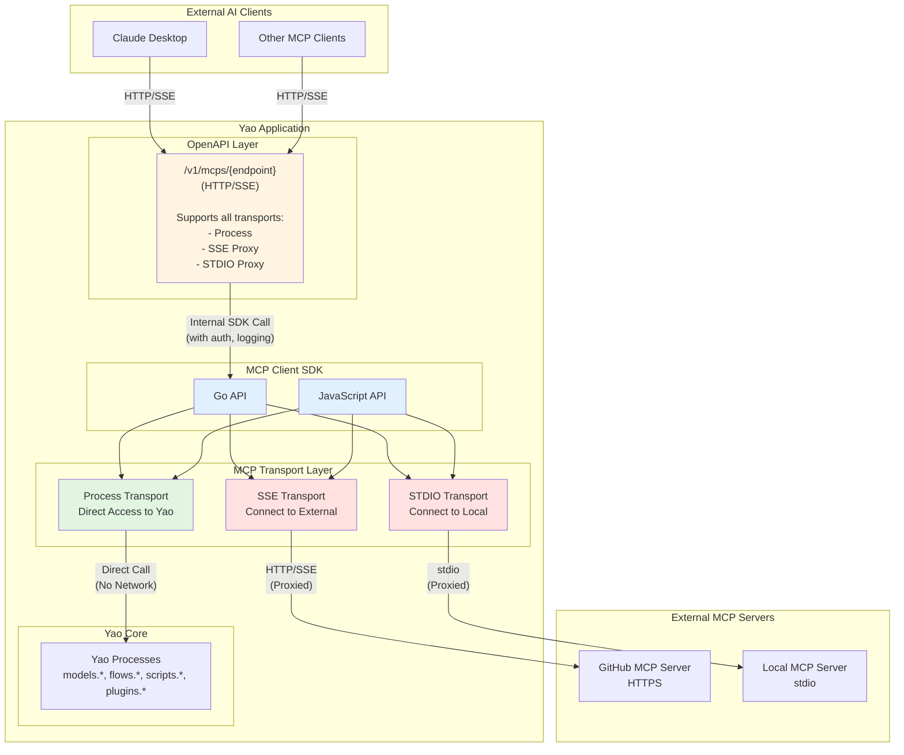
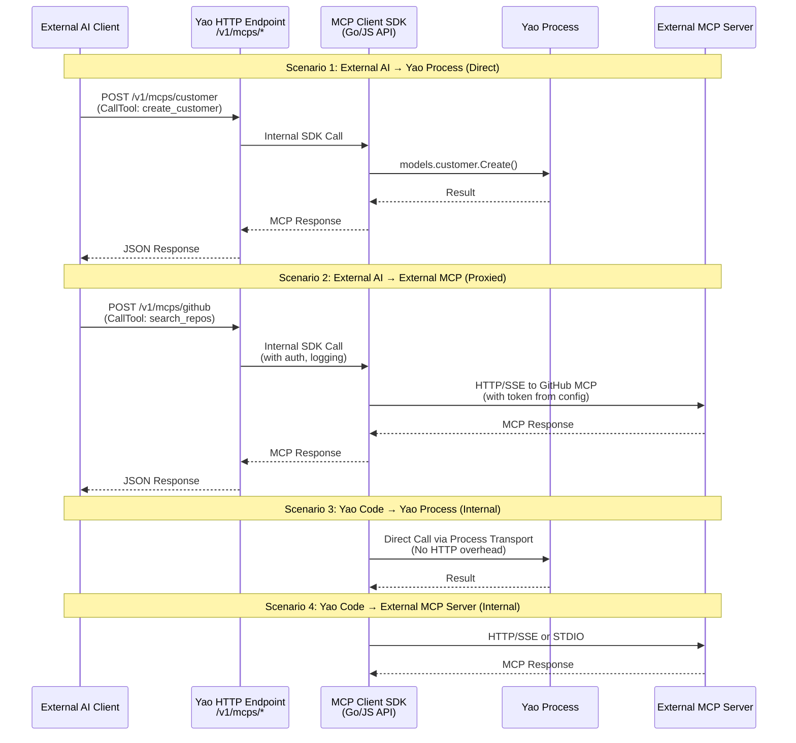

# MCP (Model Context Protocol) for Yao

Complete guide for using MCP in Yao applications, covering configuration, Go API, and JavaScript API.

## Table of Contents

- [Overview](#overview)
- [Configuration](#configuration)
  - [External MCP Clients](#external-mcp-clients)
  - [Process Transport](#process-transport)
  - [Mapping Configuration](#mapping-configuration)
- [Go API Usage](#go-api-usage)
- [JavaScript API Usage](#javascript-api-usage)
- [Examples](#examples)

## Overview

MCP (Model Context Protocol) is an open standard that enables AI systems to connect with external data sources and tools.

### Yao MCP Architecture

Yao provides a unified MCP client SDK (Go API / JavaScript API) that can connect to:

1. **External MCP Servers** - HTTP/SSE/STDIO transport to remote MCP servers
2. **Internal Process Transport** - Direct access to Yao Processes as MCP tools
3. **Exposed MCP Endpoints** - When `endpoint` is configured, Yao exposes its Process Transport via HTTP/SSE at `/v1/mcps/{endpoint}` for external AI clients



**Key Concepts**:

1. **MCP Client SDK** (Go API / JS API)

   - Unified interface for accessing MCP servers
   - Used by both internal application code and exposed endpoints
   - Supports three transport types: Process, SSE, STDIO

2. **Process Transport**

   - Maps Yao Processes directly to MCP tools and resources
   - No network overhead - direct in-process calls
   - Can be exposed externally via `endpoint` configuration

3. **External MCP Server Transports**

   - **SSE (Server-Sent Events)**: Connect to HTTP-based MCP servers
   - **STDIO**: Connect to local MCP servers via standard input/output
   - Can also be proxied via `endpoint` configuration

4. **MCP Endpoint Exposure**
   - When `endpoint` is configured in `*.mcp.yao`, Yao exposes the MCP server at `/v1/mcps/{endpoint}`
   - Works for **all transport types**:
     - **Process**: Expose Yao Processes as MCP tools
     - **SSE/STDIO**: Proxy external MCP servers (with auth, rate limiting, etc.)
   - External AI clients connect via HTTP/SSE
   - Benefits of proxying external MCP servers:
     - Centralized authentication and authorization
     - Rate limiting and access control
     - Logging and monitoring
     - Hide external server URLs from clients

**Usage Scenarios**:



### When to Use Each Approach

| Scenario                           | Key Configuration                                                    | Internal Access<br/>(Go/JS) | External Access<br/>(HTTP/SSE) | Use Case                                                                        |
| ---------------------------------- | -------------------------------------------------------------------- | --------------------------- | ------------------------------ | ------------------------------------------------------------------------------- |
| **Process<br/>Internal Only**      | `transport: "process"`<br/>No `endpoint`                             | ✅                          | ❌                             | Access Yao Processes from code<br/>Best performance, no network                 |
| **Process<br/>Exposed**            | `transport: "process"`<br/>`endpoint: "/myapp"`                      | ✅                          | ✅                             | Expose Yao Processes externally<br/>Available at `/v1/mcps/myapp`               |
| **External SSE<br/>Internal Only** | `transport: "sse"`<br/>`url: "https://..."`<br/>No `endpoint`        | ✅                          | ❌                             | Call external MCP from Yao code<br/>E.g., connect to GitHub MCP, filesystem MCP |
| **External SSE<br/>Proxy Mode**    | `transport: "sse"`<br/>`url: "https://..."`<br/>`endpoint: "/proxy"` | ✅                          | ✅                             | Proxy external MCP servers<br/>Hide API keys, unified auth                      |
| **STDIO<br/>Local Server**         | `transport: "stdio"`<br/>`command: "node ..."`                       | ✅                          | ⭕<br/>(optional)              | Connect to local MCP servers<br/>Good for development                           |

**Key Difference**:

- **No `endpoint`** = Only accessible within Yao application (via Go API or JS API)
- **With `endpoint`** = Also exposed at `/v1/mcps/{endpoint}` for external AI clients (like Claude Desktop)

**Typical Use Cases**:

1. **Process Internal Only**: Call Yao Processes from Flows or Scripts within your application
2. **Process Exposed**: Let Claude Desktop directly access your Yao application features (customer management, data processing, etc.)
3. **External SSE Internal**: Connect to external MCP servers (GitHub, Slack, filesystem) from your Yao code
4. **External SSE Proxy**: Proxy external MCP servers through Yao - useful for adding authentication, rate limiting, or providing unified access to multiple MCP servers

## Configuration

### External MCP Clients

Connect to external MCP servers via HTTP, SSE, or STDIO:

**SSE Transport - Internal Use** (`mcps/github-internal.mcp.yao`):

```json
{
  "label": "GitHub MCP Server",
  "description": "Connect to GitHub's MCP server (internal use only)",
  "transport": "sse",
  "url": "https://github.com/mcp/api",
  "headers": {
    "Authorization": "Bearer $ENV.GITHUB_TOKEN"
  },
  "capabilities": {
    "tools": { "listChanged": false },
    "resources": { "subscribe": false }
  }
}
```

Only accessible via Go API / JS API within Yao application.

**SSE Transport - Proxied for External Clients** (`mcps/github.mcp.yao`):

```json
{
  "label": "GitHub MCP Server",
  "description": "Proxied GitHub MCP server with centralized auth",
  "transport": "sse",
  "url": "https://github.com/mcp/api",
  "endpoint": "/github",
  "headers": {
    "Authorization": "Bearer $ENV.GITHUB_TOKEN"
  },
  "capabilities": {
    "tools": { "listChanged": false },
    "resources": { "subscribe": false }
  }
}
```

With `endpoint: "/github"`:

- **Internal Access**: Via Go API / JS API (calls GitHub MCP directly)
- **External Access**: Exposed at `http://your-yao-app/v1/mcps/github`
- **Benefits**:
  - External clients don't need GitHub tokens
  - Centralized authentication, rate limiting, and logging
  - Can add custom authorization logic in Yao

**STDIO Transport** (`mcps/local-server.mcp.yao`):

```json
{
  "label": "Local MCP Server",
  "description": "Connect to local MCP server via stdio",
  "transport": "stdio",
  "command": "node",
  "args": ["./mcp-server/index.js"],
  "env": {
    "NODE_ENV": "production"
  }
}
```

### Process Transport

Map Yao Processes to MCP tools and resources:

**Internal Use Only** (`mcps/internal.mcp.yao`):

```json
{
  "label": "Internal MCP Server",
  "description": "For internal use only, not exposed externally",
  "transport": "process",
  "tools": {
    "validate_data": "scripts.validator.Check"
  }
}
```

This configuration can only be accessed via Go API or JS API within the Yao application.

**Exposed to External Clients** (`mcps/customer.mcp.yao`):

```json
{
  "label": "Customer Management",
  "description": "Customer CRUD operations",
  "transport": "process",
  "endpoint": "/customer",
  "capabilities": {
    "tools": { "listChanged": false },
    "resources": { "subscribe": true, "listChanged": false }
  },
  "tools": {
    "create_customer": "models.customer.Create",
    "update_customer": "models.customer.Update",
    "delete_customer": "models.customer.Delete"
  },
  "resources": {
    "detail": "models.customer.Find",
    "list": "models.customer.Paginate"
  }
}
```

With `endpoint: "/customer"`:

- **Internal Access**: Via Go API / JS API (same as internal-only config)
- **External Access**: Exposed at `http://your-yao-app/v1/mcps/customer` (HTTP/SSE)
- External AI clients (like Claude Desktop) can connect to this endpoint

**Configuration Options**:

| Field          | Type     | Transport      | Required | Description                                                                                              |
| -------------- | -------- | -------------- | -------- | -------------------------------------------------------------------------------------------------------- |
| `transport`    | string   | All            | ✅       | Transport type: `"sse"`, `"stdio"`, or `"process"`                                                       |
| `label`        | string   | All            | ⭕       | Human-readable name                                                                                      |
| `description`  | string   | All            | ⭕       | Server description                                                                                       |
| `endpoint`     | string   | All            | ⭕       | Exposes MCP server at `/v1/mcps/{endpoint}` for external HTTP/SSE clients (works for all transports)     |
| `url`          | string   | **sse**        | ✅       | MCP server URL for SSE transport                                                                         |
| `command`      | string   | **stdio**      | ✅       | Command to start MCP server                                                                              |
| `args`         | []string | **stdio**      | ⭕       | Command arguments                                                                                        |
| `headers`      | map      | **sse**        | ⭕       | HTTP headers (e.g., Authorization) - hidden from external clients when proxied                           |
| `env`          | map      | **stdio**, sse | ⭕       | Environment variables                                                                                    |
| `capabilities` | object   | All            | ⭕       | Server capabilities declaration                                                                          |
| `tools`        | map      | **process**    | ⭕       | For Process Transport: MCP tool name → Yao Process name mapping (e.g., `"create": "models.user.Create"`) |
| `resources`    | map      | **process**    | ⭕       | For Process Transport: MCP resource name → Yao Process name mapping                                      |

**Notes**:

- **Internal SDK Access**: All transports can be accessed via Go API / JS API
- **External HTTP/SSE Access**: Any transport with `endpoint` configured can be accessed externally
- **Proxy Benefits**: When `endpoint` is set for SSE/STDIO, Yao acts as a proxy with:
  - Authentication management (API keys hidden from clients)
  - Rate limiting and access control
  - Centralized logging and monitoring
- **Process Transport**: Maps directly to Yao Processes, no external server needed

### Mapping Configuration

For `process` transport, define tool/resource schemas in the `mapping/` directory:

```
mcps/
├── customer.mcp.yao           # MCP server definition
└── mapping/
    └── customer/              # Client ID from filename
        ├── schemes/           # Tool schemas
        │   ├── create_customer.in.yao    # Input schema (required)
        │   ├── create_customer.out.yao   # Output schema (optional)
        │   └── create_customer.jsonl     # Sample data (optional)
        ├── resources/         # Resource schemas
        │   ├── detail.res.yao            # Resource definition
        │   └── detail.jsonl              # Sample data (optional)
        └── prompts/           # Prompt templates (optional)
            └── manage_customer.pmt.yao
```

#### Tool Input Schema (`schemes/*.in.yao`)

```json
{
  "type": "object",
  "description": "Create a new customer",
  "properties": {
    "name": {
      "type": "string",
      "description": "Customer name"
    },
    "email": {
      "type": "string",
      "format": "email",
      "description": "Customer email"
    }
  },
  "required": ["name", "email"],
  "x-process-args": [":arguments"]
}
```

**Parameter Mapping (`x-process-args`)**:

Maps MCP tool arguments to Yao Process positional parameters:

- `":arguments"` - Pass entire arguments object as first parameter
- `"$args.field"` - Extract specific field from arguments
- `"$args.nested.field"` - Extract nested field
- `"$field"` - Shorthand for `$args.field`
- Constant values - Pass literal strings/numbers

**Example**:

```json
{
  "x-process-args": ["$args.name", "$args.email", "active"]
}
```

Maps to: `process.Run("models.customer.Create", "John", "john@example.com", "active")`

#### Resource Schema (`resources/*.res.yao`)

```json
{
  "uri": "customers://{id}",
  "name": "Customer Detail",
  "description": "Get customer by ID",
  "mimeType": "application/json",
  "parameters": {
    "type": "object",
    "properties": {
      "id": {
        "type": "string",
        "description": "Customer ID"
      }
    },
    "required": ["id"]
  },
  "x-process-args": ["$uri.id"]
}
```

**URI Parameter Extraction (`x-process-args`)**:

- `"$uri.param"` - Extract from URI template (e.g., `{id}`)
- `"$query.param"` - Extract from query string
- `"$args.field"` - Extract from arguments (if provided)

**Example**:

```json
{
  "uri": "customers://list?page={page}&pagesize={pagesize}",
  "x-process-args": ["$query.page", "$query.pagesize", "$query.where"]
}
```

#### Sample Data (`*.jsonl`)

Provide training examples for AI:

**Tool Samples** (`schemes/*.jsonl`):

```jsonl
{"name":"create_john","description":"Create customer John","input":{"name":"John Doe","email":"john@example.com"},"output":{"id":1,"name":"John Doe","email":"john@example.com"}}
{"name":"create_jane","description":"Create customer Jane","input":{"name":"Jane Smith","email":"jane@example.com"},"output":{"id":2,"name":"Jane Smith","email":"jane@example.com"}}
```

**Resource Samples** (`resources/*.jsonl`):

```jsonl
{"name":"customer_1","description":"Get customer 1","uri":"customers://1","data":{"id":1,"name":"John Doe","email":"john@example.com"}}
{"name":"customer_list","description":"List customers","uri":"customers://list?page=1&pagesize=10","data":{"items":[{"id":1,"name":"John Doe"}],"total":1}}
```

## Go API Usage

### Loading MCP Clients

```go
import "github.com/yaoapp/gou/mcp"

// Load from file
err := mcp.LoadClient("mcps/customer.mcp.yao", "customer")

// Or load from source
source := []byte(`{"transport": "process", ...}`)
err := mcp.LoadClientSource(source, "customer", "mcps/customer.mcp.yao")

// Select a client
client, err := mcp.Select("customer")
```

### Tool Operations

```go
import (
    "context"
    "github.com/yaoapp/gou/mcp"
    "github.com/yaoapp/gou/mcp/types"
)

client, _ := mcp.Select("customer")
ctx := context.Background()

// List available tools
tools, err := client.ListTools(ctx, "")

// Call a single tool
result, err := client.CallTool(ctx, &types.CallToolRequest{
    Name: "create_customer",
    Arguments: map[string]interface{}{
        "name": "John Doe",
        "email": "john@example.com",
    },
})

// Call multiple tools sequentially
results, err := client.CallTools(ctx, []types.ToolCall{
    {Name: "create_customer", Arguments: map[string]interface{}{"name": "John"}},
    {Name: "create_customer", Arguments: map[string]interface{}{"name": "Jane"}},
})

// Call multiple tools in parallel
results, err := client.CallToolsParallel(ctx, []types.ToolCall{
    {Name: "create_customer", Arguments: map[string]interface{}{"name": "John"}},
    {Name: "create_customer", Arguments: map[string]interface{}{"name": "Jane"}},
})
```

### Resource Operations

```go
// List available resources
resources, err := client.ListResources(ctx, "")

// Read a resource
content, err := client.ReadResource(ctx, &types.ReadResourceRequest{
    URI: "customers://123",
})

// Resource with query parameters
content, err := client.ReadResource(ctx, &types.ReadResourceRequest{
    URI: "customers://list?page=1&pagesize=10",
})
```

### Prompt Operations

```go
// List available prompts
prompts, err := client.ListPrompts(ctx, "")

// Get a prompt with arguments
prompt, err := client.GetPrompt(ctx, &types.GetPromptRequest{
    Name: "manage_customer",
    Arguments: map[string]interface{}{
        "action": "create",
    },
})
```

### Sample Operations

```go
// List samples for a tool
samples, err := client.ListSamples(ctx, types.SampleTool, "create_customer")

// Get a specific sample
sample, err := client.GetSample(ctx, types.SampleTool, "create_customer", 0)

// List samples for a resource
samples, err := client.ListSamples(ctx, types.SampleResource, "detail")
```

## JavaScript API Usage

### Recommended: Using `Use()` for Automatic Cleanup

The `Use()` function automatically handles resource cleanup:

```javascript
// Simple usage
Use(MCP, "customer", (client) => {
  const tools = client.ListTools();
  const result = client.CallTool("create_customer", {
    name: "John Doe",
    email: "john@example.com",
  });
  return result;
});
// client.__release() is automatically called
```

### Tool Operations

```javascript
// List tools
Use(MCP, "customer", (client) => {
  const tools = client.ListTools();
  console.log(tools.tools.map((t) => t.name));
});

// Call a single tool
Use(MCP, "customer", (client) => {
  return client.CallTool("create_customer", {
    name: "John Doe",
    email: "john@example.com",
  });
});

// Call multiple tools sequentially
Use(MCP, "customer", (client) => {
  return client.CallTools([
    { name: "create_customer", arguments: { name: "John" } },
    { name: "create_customer", arguments: { name: "Jane" } },
  ]);
});

// Call multiple tools in parallel
Use(MCP, "customer", (client) => {
  return client.CallToolsParallel([
    { name: "create_customer", arguments: { name: "John" } },
    { name: "create_customer", arguments: { name: "Jane" } },
  ]);
});
```

### Resource Operations

```javascript
// List resources
Use(MCP, "customer", (client) => {
  const resources = client.ListResources();
  return resources.resources;
});

// Read a resource
Use(MCP, "customer", (client) => {
  const customer = client.ReadResource("customers://123");
  return customer.contents;
});

// Read with query parameters
Use(MCP, "customer", (client) => {
  const list = client.ReadResource("customers://list?page=1&pagesize=10");
  return list.contents;
});
```

### Prompt Operations

```javascript
// List prompts
Use(MCP, "customer", (client) => {
  const prompts = client.ListPrompts();
  return prompts.prompts;
});

// Get a prompt
Use(MCP, "customer", (client) => {
  const prompt = client.GetPrompt("manage_customer", {
    action: "create",
  });
  return prompt.messages;
});
```

### Sample Operations

```javascript
// List tool samples
Use(MCP, "customer", (client) => {
  const samples = client.ListSamples("tool", "create_customer");
  return samples.samples;
});

// Get a specific sample
Use(MCP, "customer", (client) => {
  const sample = client.GetSample("tool", "create_customer", 0);
  return { input: sample.input, output: sample.output };
});

// List resource samples
Use(MCP, "customer", (client) => {
  return client.ListSamples("resource", "detail");
});
```

### Nested MCP Clients

```javascript
function validateAndProcess(schema, customerId) {
  return Use(MCP, "dsl", (dslClient) => {
    // Validate schema with DSL client
    const validation = dslClient.CallTool("validate_schema", { schema });

    if (!validation.isValid) {
      throw new Error("Invalid schema");
    }

    // Process customer with another client
    return Use(MCP, "customer", (customerClient) => {
      return customerClient.CallTool("update_customer", {
        id: customerId,
        schema: validation.normalized,
      });
    });
  });
}
```

### Error Handling

```javascript
function safeToolCall(toolName, args) {
  try {
    return Use(MCP, "customer", (client) => {
      return client.CallTool(toolName, args);
    });
    // Resource cleanup happens automatically even if error occurs
  } catch (error) {
    console.error("Tool call failed:", error.message);
    return { error: error.message };
  }
}
```

### Alternative: Manual Resource Management

For complex control flow:

```javascript
function complexWorkflow(customerId) {
  const client = new MCP("customer");

  try {
    // Read customer
    const customer = client.ReadResource(`customers://${customerId}`);

    // Complex logic with early returns
    if (customer.status === "inactive") {
      return null;
    }

    // Update customer
    return client.CallTool("update_customer", {
      id: customerId,
      lastAccess: new Date().toISOString(),
    });
  } finally {
    // Always release resources
    client.Release();
  }
}
```

## Examples

### Complete Go Example

```go
package main

import (
    "context"
    "fmt"
    "github.com/yaoapp/gou/application"
    "github.com/yaoapp/gou/mcp"
    "github.com/yaoapp/gou/mcp/types"
)

func main() {
    // Load application
    app, err := application.OpenFromDisk("./app")
    if err != nil {
        panic(err)
    }
    application.Load(app)

    // Load MCP client
    err = mcp.LoadClient("mcps/customer.mcp.yao", "customer")
    if err != nil {
        panic(err)
    }

    // Use the client
    client, _ := mcp.Select("customer")
    ctx := context.Background()

    // Create customer
    result, err := client.CallTool(ctx, &types.CallToolRequest{
        Name: "create_customer",
        Arguments: map[string]interface{}{
            "name":  "John Doe",
            "email": "john@example.com",
        },
    })
    if err != nil {
        panic(err)
    }

    fmt.Printf("Created customer: %+v\n", result)

    // Read customer
    content, err := client.ReadResource(ctx, &types.ReadResourceRequest{
        URI: "customers://1",
    })
    if err != nil {
        panic(err)
    }

    fmt.Printf("Customer data: %+v\n", content)
}
```

### Complete JavaScript Example

```javascript
/**
 * Customer management functions using MCP
 */

// Create a new customer
function createCustomer(name, email) {
  return Use(MCP, "customer", (client) => {
    return client.CallTool("create_customer", {
      name: name,
      email: email,
    });
  });
}

// Get customer by ID
function getCustomer(customerId) {
  return Use(MCP, "customer", (client) => {
    const result = client.ReadResource(`customers://${customerId}`);
    return result.contents;
  });
}

// List customers with pagination
function listCustomers(page, pageSize) {
  return Use(MCP, "customer", (client) => {
    const uri = `customers://list?page=${page}&pagesize=${pageSize}`;
    const result = client.ReadResource(uri);
    return result.contents;
  });
}

// Update customer
function updateCustomer(customerId, updates) {
  return Use(MCP, "customer", (client) => {
    return client.CallTool("update_customer", {
      id: customerId,
      ...updates,
    });
  });
}

// Batch create customers
function batchCreateCustomers(customers) {
  return Use(MCP, "customer", (client) => {
    const calls = customers.map((c) => ({
      name: "create_customer",
      arguments: c,
    }));

    // Create in parallel for better performance
    return client.CallToolsParallel(calls);
  });
}

// Usage example
const result = createCustomer("John Doe", "john@example.com");
console.log("Created:", result);

const customer = getCustomer(result.id);
console.log("Customer:", customer);
```

## API Documentation

- [Go API Reference](./interfaces.go) - Full Go interface documentation
- [JavaScript API Reference](./jsapi/README.md) - Complete JSAPI guide with examples
- [Use() Function Guide](../runtime/v8/functions/use/README.md) - Resource management pattern

## Configuration Examples

- [gou-dev-app/mcps/](../../gou-dev-app/mcps/) - Example MCP server configurations
- [Process Transport Guide](../../gou-dev-app/mcps/README.md) - Detailed Process Transport documentation

## Best Practices

### Configuration

1. **Use environment variables** for sensitive data (API keys, tokens)
2. **Provide clear descriptions** for all tools and resources
3. **Define comprehensive schemas** with proper validation
4. **Include sample data** to help AI understand usage patterns

### Go Usage

1. **Always check errors** when calling MCP methods
2. **Use context with timeout** for production code
3. **Reuse clients** - don't create new clients for each request
4. **Use parallel calls** when calling multiple independent tools

### JavaScript Usage

1. **Prefer `Use()`** for automatic resource management
2. **Handle errors with try-catch** around `Use()` calls
3. **Nest `Use()` naturally** for multiple clients
4. **Use manual `try-finally`** only for complex control flow

### Mapping Configuration

1. **Keep schemas simple** - focus on essential parameters
2. **Use `x-process-args`** to map parameters correctly
3. **Provide meaningful sample data** - use realistic examples
4. **Document complex mappings** with comments in schema files

## Learn More

- [Model Context Protocol Specification](https://modelcontextprotocol.io/)
- [Yao Framework Documentation](https://yaoapps.com/docs)
- [JSON Schema Reference](https://json-schema.org/)
